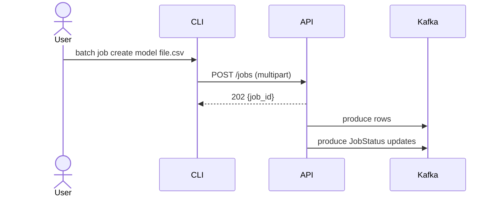

# Batch Ingestion System – Design Doc

## Purpose

Provide a lightweight service that **uploads large CSV or Parquet files**, validates basic format, and streams rows into **Redpanda** for downstream machine‑learning pipelines.

## Functional Requirements

| ID | Requirement |
|----|-------------|
| FR‑1 | Clients upload files via `POST /jobs` as **multipart/form‑data**. |
| FR‑2 | Maximum file size is **1 GiB**. The server rejects anything larger with `413 Payload Too Large` and code **FILE_TOO_LARGE**. |
| FR‑3 | Supported formats: CSV, Parquet. The server **peeks 4‑bytes** to detect Parquet (`PAR1`) and otherwise assumes CSV after sniff. |
| FR‑4 | Each upload spawns a **job** with 8‑character alphanumeric UID. |
| FR‑5 | For every job, the service creates two topics:<br/>`batch_<job_id>` and `batch_<job_id>_dlq`. |
| FR‑6 | Topics have **delete cleanup** and **7‑day retention**. |
| FR‑7 | Job status is emitted to `batch.jobs` (compact cleanup). |
| FR‑8 | CLI mirrors all REST endpoints and emits **actionable error messages**. |
| FR‑9 | No auth; all endpoints are open (`localhost` scope). |
| FR‑10 | The HTTP server **boots even when Kafka is down**. Uploads during downtime return `503 Service Unavailable` with code **KAFKA_UNAVAILABLE**. |

## Non‑Functional Requirements

| Category | Goal |
|----------|------|
| Scalability | ≥ 200 MB/s sustained stream; CSV parsing is O(line) using Go stdlib. |
| Reliability | Jobs can be cancelled; DLQ summarises row‑level rejects. |
| Observability | Structured logs (JSON), `/healthz` endpoint for liveness. |
| DX | Single `up.sh` starts entire stack; `down.sh --clean` removes artefacts. |
| Portability | Only dependency is Docker. Build scripts produce static binaries. |

## Error Taxonomy

| Code | HTTP | Meaning | CLI Action |
|------|------|---------|------------|
| FILE_TOO_LARGE | 413 | Upload > 1 GiB | Fail immediately |
| UNSUPPORTED_FILE_TYPE | 400 | Not CSV/Parquet | Surface to user |
| MODEL_NOT_FOUND | 404 | Unknown model_id | Ask to run `model list` |
| KAFKA_UNAVAILABLE | 503 | Brokers unreachable | Suggest `up.sh` |
| JOB_NOT_FOUND | 404 | Unknown job | Inform & exit 1 |
| INTERNAL_ERROR | 500 | Unhandled exception | Print msg; open GitHub issue |

## RESTful API

*(See table in README for full list; below highlights error flows)*

* `POST /jobs`  
  * `202 Accepted` – returns `{{job_id}}`  
  * `400` **UNSUPPORTED_FILE_TYPE**  
  * `413` **FILE_TOO_LARGE**  
  * `503` **KAFKA_UNAVAILABLE**

## Kafka Topic Contracts

```text
batch.jobs             key=job_id   val=JobStatus JSON (compact)
batch_<job_id>         val=raw CSV or Parquet bytes (delete, 7d)
batch_<job_id>_dlq     val=RejectedRow JSON       (delete, 7d)
```

## Engineering Design

### Upload Path



### Startup Behaviour

* API initialises **kafka-go** writer **lazily**.  
* If brokers unreachable, upload endpoints reply with **503**.  
* Background goroutine verifies brokers availability every 30 s.

### Parquet Detection

The server reads the first **4 bytes** of the upload.  
`"PAR1"` → Parquet. Otherwise fallback CSV.  

Ref: Apache Parquet spec citeturn0search4

### Build & Deploy

* `build.sh` uses **multi‑stage Dockerfiles** for small Alpine runtime images.  
* `docker-compose.yml` pins to `${{REDPANDA_VERSION}}` overrideable via env.  
* Containers run as **non‑root** (UID 10001).

## Future Work

* Integrate Arrow stream writer for zero‑copy row dispatch.  
* Schema‑aware validation using Redpanda Schema Registry API citeturn0search7  
* Persistent metadata store (Postgres) to replace in‑memory maps.

---
_Last updated: 2025-06-22T20:27:59
